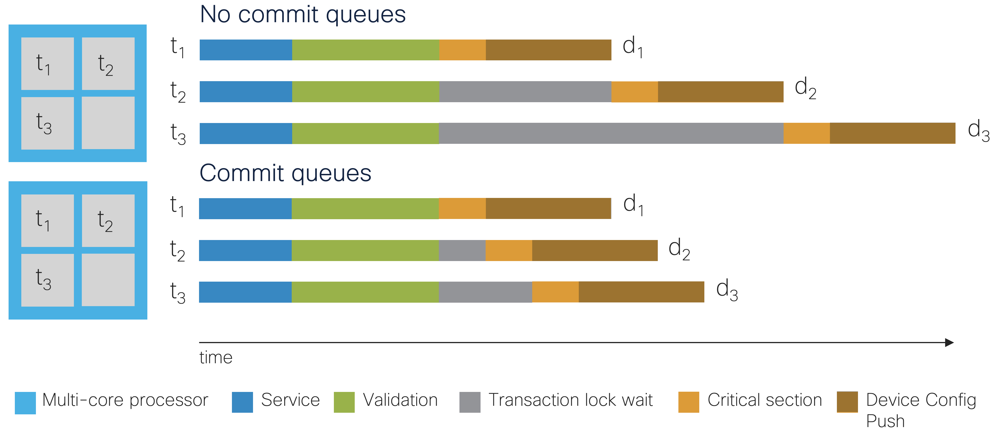

# Designing for Maximal Transaction Throughput

[](https://developer.cisco.com/devenv/?id=devenv-base-vscode-nso-local&GITHUB_SOURCE_REPO=https://github.com/NSO-developer/nso-concurrency-model)

Learn more about the NSO concurrency model and how to optimize for transaction throughput. I.e., transaction wall-clock time performance.

[Click here](https://developer.cisco.com/devenv/?id=devenv-base-vscode-nso-local&GITHUB_SOURCE_REPO=https://github.com/NSO-developer/nso-concurrency-model) to practice this lab on the NSO Playground.

An [overview presentation](https://youtu.be/yC1zNDEWAGI?si=bZBr2Pz8oxRcFXZD) of the NSO features used by this lab.

## Objectives

After completing this lab, you will learn how to:

- Design for concurrency
- Measure transaction performance
- Write the configuration from the service create callback using a single API function call
- Run NSO transactions concurrently
- Use commit queues
- Implement a resource-facing nano service to divide a single transaction into
  one transaction per service instance and CPU core
- Use LSA to scale transaction performance beyond a single multi-core processor

# The NSO Transaction Manager

NSO has two main layers: the Device Manager and the Service Manager. They serve different purposes but are tightly integrated with the transactional engine and database.

Since version 6.0, the NSO transaction manager has used optimistic concurrency, significantly improving transaction parallelism. With this approach, NSO avoids the need for serialization and a global lock to run user code, which would otherwise limit the number of requests the system can process in a given time unit.


There are four areas where the NSO user can significantly affect the transaction throughput performance:

- Run multiple transactions concurrently. For example, multiple concurrent RESTCONF or NETCONF edits, CLI commits, MAAPI apply(), nano service re-deploy, etc.
- Design to avoid conflicts and minimize the service create() and validation implementation. For example, in service templates and code mapping to devices or other service instances, YANG must statements with XPath expressions or validation code, write the configuration in as few API calls as possible.
- Using commit queues to exclude the time to push configuration changes to devices from inside the transaction lock.
- Simplify using nano and stacked services. If the processor where NSO with a stacked service runs becomes a severe bottleneck, the added complexity of migrating the stacked service to an LSA setup can be motivated. LSA helps expose only a single service instance when scaling up the number of devices by increasing the number of available CPU cores beyond a single processor.


# Measuring Transaction Throughput

Measuring transaction performance includes measuring the total wall-clock time for the service deployment transaction(s) and using the detailed NSO progress trace of the transactions to find bottlenecks. The developer log helps debug the NSO internals, and the XPath trace log helps find misbehaving XPath expressions used in, for example, YANG `must` statements. The picture below shows a visualization of the NSO progress trace when running a single transaction for two service instances configuring a device each:


The total RESTCONF edit took ~5 seconds, and the service mapping (“creating service” event) and validation (“run validation ...” event) were done sequentially for the service instances and took 2 seconds each. The configuration push to the devices was done concurrently in 1 second.

See the `showcase.sh` and `measure.py` scripts plus the `ncs.conf` files in the examples on how to enable and disable the progress trace, and the simple progress trace viewer Python script under the `common` folder.

For progress trace documentation, see the [NSO Development Guide](https://cisco-tailf.gitbook.io/nso-docs/guides/development/advanced-development/progress-trace).

## Running the `perf-trans` Example Using a Single Transaction

The `perf-trans` example from the NSO example set explores the opportunities to improve the wallclock time performance and utilization, as well as opportunities to avoid common pitfalls.

The example uses simulated CPU loads for service creation and validation work. Device work is simulated with `sleep()` as it will not run on the same processor in a production system.

The example shows how NSO can benefit from running many transactions concurrently if the service and validation code allow concurrency. It uses the NSO progress trace feature to get detailed timing information for the transactions in the system.

The provided code sets up an NSO instance that exports tracing data to a `.csv` file, provisions one or more service instances, which each map to a device, and shows different (average) transaction times and a graph to visualize the sequences plus concurrency.

Play with the `perf-trans` example by tweaking the `measure.py` script parameters:

        -nt NTRANS, --ntrans NTRANS
            The number of transactions updating the same service in parallel. For this
            example, we use NTRANS parallel RESTCONF plain patch.
            Default: 1.

        -nw NWORK, --nwork NWORK
            Work per transaction in the service creation and validation phases. One
            second of CPU time per work item.
            Default: 3 seconds of CPU time.

        -nd 0..10, --ndtrans 0..10
            Number of devices the service will configure per service transaction.
            Default: 1

        -dd DDELAY, --ddelay DDELAY
            Transaction delay (simulated by sleeping) on the netsim devices (seconds).
            Default: 0s

        -cq {async,sync,bypass,none}, --cqparam {async,sync,bypass,none}
            Commit queue behavior. Select "none" to use the global or device setting.
            Default: none

See the `README` in the perf-trans example for details.

To run the `perf-trans` example from the NSO example set and recreate the variant shown in the progress trace above:

```bash
cd $NCS_DIR/examples.ncs/scaling-performance/perf-trans
make NDEVS=2 python
python3 measure.py --ntrans 1 --nwork 2 --ndtrans 2 --cqparam bypass --ddelay 1
python3 ../common/simple_progress_trace_viewer.py $(ls logs/*.csv)
```

The following is a sequence diagram and the progress trace of the example, describing the transaction `t1`. The transaction deploys service configuration to the devices using a single RESTCONF `patch` request to NSO and then NSO configures the netsim devices using NETCONF:

        RESTCONF   service   validate   push config
        patch      create    config     ndtrans=2        netsim
        ntrans=1   nwork=2   nwork=2    cqparam=bypass   device    ddelay=1
          t0 ------> 2s -----> 2s -----------------------> ex0 -----> 1s
                                            \------------> ex1 -----> 1s
          wall-clock 2s        2s                                     1s = 5s

The only part running concurrently in the example above was configuring the devices. It is the most straightforward option if transaction throughput performance is not a concern or the service creation and validation work are insignificant. A single transaction service deployment will not need to use commit queues as it is the only transaction holding the transaction lock configuring the devices inside the critical section. See the “holding transaction lock” event in the progress trace above.

Stop NSO and the netsim devices:
```bash
make stop
```

# Concurrent Transactions

Everything from smartphones and tablets to laptops, desktops, and servers now contain multi-core processors. For maximal throughput, the powerful multi-core systems need to be fully utilized. This way, the wall clock time is minimized when deploying service configuration changes to the network, which is usually equated with performance. Therefore, enabling NSO to spread as much work as possible across all available cores becomes important. The goal is to have service deployments maximize their utilization of the total available CPU time to deploy services faster to the users who ordered them.

Close to full utilization of every CPU core when running under maximal load, for example, ten transactions to ten devices, is ideal, as some process viewer tools such as `htop` visualize with meters:

        0[|||||||||||||||||||||||||||||||||||||||||||||||||100.0%]
        1[|||||||||||||||||||||||||||||||||||||||||||||||||100.0%]
        2[||||||||||||||||||||||||||||||||||||||||||||||||||99.3%]
        3[||||||||||||||||||||||||||||||||||||||||||||||||||99.3%]
        4[||||||||||||||||||||||||||||||||||||||||||||||||||99.3%]
        5[||||||||||||||||||||||||||||||||||||||||||||||||||99.3%]
        6[||||||||||||||||||||||||||||||||||||||||||||||||||98.7%]
        7[||||||||||||||||||||||||||||||||||||||||||||||||||98.7%]
        8[||||||||||||||||||||||||||||||||||||||||||||||||||98.7%]
        9[||||||||||||||||||||||||||||||||||||||||||||||||||98.7%]
        ...

One transaction per RFS instance and device will allow each NSO transaction to run on a separate core concurrently. Multiple concurrent RESTCONF or NETCONF edits, CLI commits, MAAPI `apply()`, nano service re-deploy, etc. Keep the number of running concurrent transactions equal to or below the number of cores available in the multi-core processor to avoid performance degradation due to increased contention on system internals and resources. NSO helps by limiting the number of transactions applying changes in parallel to, by default, the number of logical processors (e.g., CPU cores). See the [ncs.conf(5)](https://developer.cisco.com/docs/nso/api/ncs-man-pages-volume-5/#ncs-conf) man page under `/ncs-config/transaction-limits/max-transactions` for details.


# Designing to Minimize Conflicts

Conflicts between transactions and how to avoid them are described in the NSO Development Guide chapter [NSO Concurrency Model](https://cisco-tailf.gitbook.io/nso-docs/guides/development/core-concepts/nso-concurrency-model). While NSO can handle transaction conflicts gracefully with retries, retries affect transaction throughput performance. A simple but effective design pattern to avoid conflicts is to update one device with one Resource Facing Service (RFS) instance where service instances do not read each other's configuration changes.


An overly complex service or validation implementation using templates, code, and XPath expressions increases the processing required and, even if transactions are processed concurrently, will affect the wall-clock time spent processing and, thus, transaction throughput.

When data processing performance is of interest, the best practice rule of thumb is to ensure that `must` and `when` statement XPath expressions in YANG models and service templates are only used as necessary and kept as simple as possible.

If a service creates a significant amount of configuration data for devices, it is often significantly faster using a single MAAPI `shared_set_values()` call instead of using multiple `create()` and `set()` calls or a service template.

## Running the `perf-setvals` Example Using a Single Call to MAAPI `shared_set_values()`

The `perf-setvals` example writes configuration to an access control list and a route list of a Cisco Adaptive Security Appliance (ASA) device. It uses either MAAPI Python `create()` and `set()` calls, Python `shared_set_values()`, or Java `sharedSetValues()` to write the configuration in XML format.

To run the `perf-setvals` example using MAAPI Python `create()` and `set()` calls to create 3000 rules and 3000 routes on one device:

```bash
cd $NCS_DIR/examples.ncs/scaling-performance/perf-setvals
./measure.sh -r 3000 -t py_create -n true
```

The commit uses the `no-networking` parameter to skip pushing the configuration to the simulated and un-proportionally slow Cisco ASA netsim device. The resulting NSO progress trace:


Next, run the `perf-setvals` example using a single MAAPI Python `shared_set_values()` call to create 3000 rules and 3000 routes on one device:

```bash
./measure.sh -r 3000 -t py_setvals_xml -n true
```

The resulting NSO progress trace:


Using the MAAPI `shared_set_values()` function, the service `create` callback is, for this example, ~5x faster than using the MAAPI `create()` and `set()` functions. The total wall-clock time for the transaction is more than 2x faster, and the difference will increase for larger transactions.

Stop NSO and the netsim devices:
```bash
make stop
```

# Use a Data-Kicker Instead of a CDB Subscriber

A kicker triggering on a CDB change, a data-kicker, should be used instead of a CDB subscriber when the action taken does not have to run inside the transaction lock, i.e., the critical section of the transaction. A CDB subscriber will be invoked inside the critical section and, thus, will have negative impact on the transaction throughput. See the NSO Development Guide [Improving Subscribers](https://cisco-tailf.gitbook.io/nso-docs/guides/development/advanced-development/scaling-and-performance-optimization#ncs.development.scaling.kicker) for more details.

# Shorten the Time Used for Writing Configuration to Devices

Writing to devices and other network elements that are slow to configure will stall transaction throughput if you do not enable commit queues, as transactions waiting for the transaction lock to be released cannot start configuring devices before the transaction ahead of them is done writing. For example, if one device is configured using CLI transported with [IP over Avian Carriers](https://datatracker.ietf.org/doc/html/rfc1149), the transactions, including such a device, will significantly stall transactions behind it going to devices supporting [RESTCONF](https://datatracker.ietf.org/doc/html/rfc8040) or [NETCONF](https://datatracker.ietf.org/doc/html/rfc6241) over a fast optical transport. Where transaction throughput performance is a concern, choosing devices that can be configured efficiently to implement their part of the service configuration is wise.

# Running the `perf-trans` Example Using One Transaction per Device

Dividing the service creation and validation work into two separate transactions, one per device, allows the work to be spread across two CPU cores in a multi-core processor. To run the `perf-trans` example with the work divided into one transaction per device:

```bash
cd $NCS_DIR/examples.ncs/scaling-performance/perf-trans
make stop clean NDEVS=2 python
python3 measure.py --ntrans 2 --nwork 1 --ndtrans 1 --cqparam bypass --ddelay 1
python3 ../common/simple_progress_trace_viewer.py $(ls logs/*.csv)
```

The resulting NSO progress trace:


A sequence diagram with transactions `t1` and `t2` deploying service configuration to two devices using RESTCONF `patch` requests to NSO with NSO configuring the netsim devices using NETCONF:

        RESTCONF   service   validate   push config
        patch      create    config     ndtrans=1       netsim            netsim
        ntrans=2   nwork=1   nwork=1    cqparam=bypass  device  ddelay=1  device  ddelay=1
          t1 ------> 1s -----> 1s ---------------------> ex0 ---> 1s
          t2 ------> 1s -----> 1s ---------------------------------------> ex1 ---> 1s
          wall-clock 1s        1s                                 1s                1s = 4s

Note how the service creation and validation work now is divided into 1s per transaction and runs concurrently on one CPU core each. However, the two transactions cannot push the configuration concurrently to a device each as the config push is done inside the critical section, making one of the transactions wait for the other to release the transaction lock. See the two `holding the transaction lock` events in the above progress trace visualization.

To enable transactions to push configuration to devices concurrently, we must enable ***commit queues***.

# Using Commit Queues

The concept of a network-wide transaction requires NSO to wait for the managed devices to process the configuration change before exiting the critical section, i.e., before NSO can release the transaction lock. In the meantime, other transactions have to wait their turn to write to CDB and the devices. The commit queue feature avoids waiting for configuration to be written to the device and increases the throughput. For most use cases, commit queues improve transaction throughput significantly.

Writing to a commit queue instead of the device moves the device configuration push outside of the critical region, and the transaction lock can instead be released when the change has been written to the commit queue.



For commit queue documentation, see the NSO Operation & Usage Guide chapter [Commit Queue](https://cisco-tailf.gitbook.io/nso-docs/guides/operation-and-usage/operations/nso-device-manager#user_guide.devicemanager.commit-queue).

## Enabling Commit Queues for the perf-trans Example

Enabling commit queues allows the two transactions to spread the create, validation, ***and*** configuration push to devices work across CPU cores in a multi-core processor. Only the CDB write and commit queue write now remain inside the critical section, and the transaction lock is released as soon as the device configuration changes have been written to the commit queues instead of waiting for the config push to the devices to complete. To run the `perf-trans` example with the work divided into one transaction per device and commit queues enabled:

```bash
make stop clean NDEVS=2 python
python3 measure.py --ntrans 2 --nwork 1 --ndtrans 1 --cqparam sync --ddelay 1
python3 ../common/simple_progress_trace_viewer.py $(ls logs/*.csv)
```

The resulting NSO progress trace:


A sequence diagram with transactions `t1` and `t2` deploying service configuration to two devices using RESTCONF `patch` requests to NSO with NSO configuring the netsim devices using NETCONF:

        RESTCONF   service   validate   push config
        patch      create    config     ndtrans=1        netsim
        ntrans=2   nwork=1   nwork=1    cqparam=sync     device    ddelay=1
          t1 ------> 1s -----> 1s --------------[----]---> ex0 -----> 1s
          t2 ------> 1s -----> 1s --------------[----]---> ex1 -----> 1s
          wall-clock 1s        1s                                     1s = 3s

Note how the the two transactions now push the configuration concurrently to a device each as the config push is done outside of the critical section. See the two `push configuration` events in the above progress trace visualization.

Stop NSO and the netsim devices:
```bash
make stop
```

Running the `perf-setvals` example with two devices and commit queues enabled will produce a similar result.

# Simplify the Per-Device Concurrent Transaction Creation Using a Nano Service

The `perf-trans` example service uses one transaction per service instance where each service instance configures one device. This enables transactions to run concurrently on separate CPU cores in a multi-core processor. The example sends RESTCONF `patch` requests concurrently to start transactions that run concurrently with the NSO transaction manager. However, dividing the work into multiple processes may not be practical for some applications using the NSO northbound interfaces, e.g., CLI or RESTCONF. Also, it makes a future migration to LSA more complex.

To simplify the NSO manager application, a resource-facing nano service (RFS) can start a process per service instance. The NSO manager application or user can then use a single transaction, e.g., CLI or RESTCONF, to configure multiple service instances where the NSO nano service divides the service instances into transactions running concurrently in separate processes.


The nano service can be straightforward, for example, using a single `t3:configured` state to invoke a service template or a `create()` callback. If validation code is required, it can run in a nano service post-action, `t3:validated` state, instead of a validation point callback to keep the validation code in the process created by the nano service.


See the NSO Development Guide chapter [Nano Services](https://cisco-tailf.gitbook.io/nso-docs/guides/development/core-concepts/nano-services) and chapter [Develop and Deploy a Nano Service](https://cisco-tailf.gitbook.io/nso-docs/guides/development/introduction-to-automation/develop-and-deploy-a-nano-service) for nano service documentation.

# Simplify Using a CFS

A Customer Facing Service (CFS) that is stacked with the RFS and maps to one RFS instance per device can simplify the service that is exposed to the NSO northbound interfaces so that a single NSO northbound interface transaction spawns multiple transactions, for example, one transaction per RFS instance when using the `converge-on-re-deploy` YANG extension with the nano service behavior tree.


## Running the CFS and Nano Service Enabled perf-stack Example

The `perf-stack` example showcases how a CFS on top of a simple resource-facing nano service can be implemented with the `perf-trans` example by modifying the existing t3 RFS and adding a CFS. Instead of multiple RESTCONF transactions, the example uses a single CLI CFS service commit that updates the desired number of service instances. The commit configures multiple service instances in a single transaction where the nano service runs each service instance in a separate process to allow multiple cores to be used concurrently.


Run as below to start two transactions with a 1-second CPU time workload per transaction in both the service and validation callbacks, each transaction pushing the device configuration to one device, each using a synchronous commit queue, where each device simulates taking 1 second to make the configuration changes to the device:

```bash
cd $NCS_DIR/examples.ncs/scaling-performance/perf-stack
./showcase.sh -d 2 -t 2 -w 1 -r 1 -q 'True' -y 1
```


The above progress trace visualization is truncated to fit, but notice how the `t3:validated` state action callbacks, `t3:configured` state service creation callbacks, and configuration push from the commit queues are running concurrently (on separate CPU cores) when initiating the service deployment with a single transaction started by the CLI commit.

A sequence diagram describing the transaction `t1` deploying service configuration to the devices using the NSO CLI:

                                                                      config
                CFS             validate  service  push config        change
        CLI     create    Nano  config    create   ndtrans=1   netsim subscriber
        commit  trans=2   RFS   nwork=1   nwork=1  cq=True     device ddelay=1
                          t1 --> 1s -----> 1s -------[----]---> ex0 ---> 1s
          t -----> t --->
                          t2 --> 1s -----> 1s -------[----]---> ex1 ---> 1s
                      wall-clock 1s        1s                            1s=3s

The two transactions run concurrently, deploying the service in ~3 seconds (plus some overhead) of wall-clock time. Like the `perf-trans` example, you can play around with the `perf-stack` example by tweaking the parameters.

        -d  NDEVS
            The number of netsim (ConfD) devices (network elements) started.
            Default 4

        -t  NTRANS
            The number of transactions updating the same service in parallel.
            Default: $NDEVS

        -w  NWORK
            Work per transaction in the service creation and validation phases. One
            second of CPU time per work item.
            Default: 3 seconds of CPU time.

        -r  NDTRANS
            Number of devices the service will configure per service transaction.
            Default: 1

        -c  USECQ
            Use device commit queues.
            Default: True

        -y  DEV_DELAY
            Transaction delay (simulated by sleeping) on the netsim devices (seconds).
            Default: 1 second

See the `README` in the `perf-stack` example for details. For even more details, see the steps in the `showcase` script.

Stop NSO and the netsim devices:

```bash
make stop
```

# Migrating to and Scale Up Using an LSA Setup

If the processor where NSO runs becomes a severe bottleneck, the CFS can migrate to a layered service architecture (LSA) setup. The `perf-stack` example implements stacked services, a CFS abstracting the RFS. It allows for easy migration to an LSA setup to scale with the number of devices or network elements participating in the service deployment. While adding complexity, LSA allows exposing a single CFS instance for all processors instead of one per processor.

> ***Note:***
> Before considering taking on the complexity of a multi-NSO node LSA setup, make sure you have done the following:
>
> * Explored all possible avenues of design and optimization improvements described so far in this section.
> * Measured the transaction performance to find bottlenecks.
> * Optimized any bottlenecks to reduce their overhead as much as possible.
> * Observe that the available processor cores are all fully utilized.
> * Explored running NSO on a more powerful processor with more CPU cores and faster clock speed.
> * If there are more devices and RFS instances created at one point than available CPU cores, verify that increasing the number of CPU cores will result in a significant improvement. I.e., if the CPU processing spent on service creation and validation is substantial, the bottleneck, compared to writing the configuration to CDB and the commit queues and pushing the configuration to the devices.
>
> Migrating to an LSA setup should only be considered after checking all boxes for the above items.


## Running the LSA-enabled `perf-lsa` Example

The `perf-lsa` example builds on the `perf-stack` example and showcases an LSA setup using two RFS NSO instances, `lower-nso-1` and `lower-nso-2`, with a CFS NSO instance, `upper-nso`.


You can imagine adding more RFS NSO instances, `lower-nso-3`, `lower-nso-4`, etc., to the existing two as the number of devices increases. One NSO; instance per multi-core processor and at least one CPU core per device (network element) is likely the most performant setup for this simulated work example. See the NSO Administration Guide chapter [Layered Service Architecture](https://cisco-tailf.gitbook.io/nso-docs/guides/administration/advanced-topics/layered-service-architecture) for more.

As an example, a variant that starts four RFS transactions with a 1-second CPU time workload per transaction in both the service and validation callbacks, each RFS transaction pushing the device configuration to 1 device using synchronous commit queues, where each device simulates taking 1 second to make the configuration changes to the device:

```bash
cd $NCS_DIR/examples.ncs/scaling-performance/perf-lsa
./showcase.sh -d 2 -t 2 -w 1 -r 1 -q 'True' -y 1
```

The three NSO progress trace visualizations show NSO on the CFS and the two RFS nodes. Notice how the CLI commit starts a transaction on the CFS node and configures four service instances with two transactions on each RFS node to push the resulting configuration to four devices.

### NSO CFS node


### NSO RFS node 1 (truncated to fit)


### NSO RFS node 2 (truncated to fit)


A sequence diagram describing the transactions on RFS 1 `t1` `t2` and RFS 2 `t1` `t2`. The transactions deploy service configuration to the devices using the NSO CLI:

                                                                     config
               CFS             validate  service  push config        change
        CLI    create    Nano  config    create   ndtrans=1   netsim subscriber
        commit ntrans=2  RFS 1 nwork=1   nwork=1  cq=True     device ddelay=1
          t -----> t ---> t1 --> 1s -----> 1s -------[----]---> ex0 ---> 1s
                    \     t2 --> 1s -----> 1s -------[----]---> ex1 ---> 1s
                     \   RFS 2
                      --> t1 --> 1s -----> 1s -------[----]---> ex2 ---> 1s
                          t2 --> 1s -----> 1s -------[----]---> ex3 ---> 1s
                      wall-clock 1s        1s                            1s=3s

The four transactions run concurrently, two per RFS node, performing the work and configuring the four devices in ~3 seconds (plus some overhead) of wall-clock time.

You can play with the `perf-lsa` example by tweaking the parameters.

-d  LDEVS
    Number of netsim (ConfD) devices (network elements) started per RFS
    NSO instance.
    Default 2 (4 total)

-t  NTRANS
    Number of transactions updating the same service in parallel per RFS
    NSO instance. Here, one per device.
    Default: $LDEVS ($LDEVS * 2 total)

-w  NWORK
    Work per transaction in the service creation and validation phases. One
    second of CPU time per work item.
    Default: 3 seconds of CPU time.

-r  NDTRANS
    Number of devices the service will configure per service transaction.
    Default: 1

-q  USECQ
    Use device commit queues.
    Default: True

-y  DEV_DELAY
    Transaction delay (simulated by sleeping) on the netsim devices (seconds).
    Default: 1 second

See the `README` in the `perf-lsa` example for details. For even more details, see the steps in the `showcase` script.

Stop NSO and the netsim devices:

```bash
make stop
```
