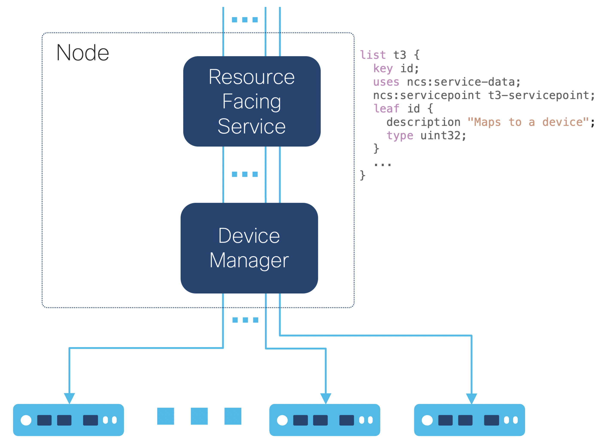

# NSO Concurrency Model

[](https://developer.cisco.com/devenv/?id=devenv-base-vscode-nso-local&GITHUB_SOURCE_REPO=https://github.com/NSO-developer/nso-concurrency-model)

Learn more about the NSO concurrencty model and how to optimize for transaction throughput. I.e. transaction wall-clock time performance.

[Click here](https://developer.cisco.com/devenv/?id=devenv-base-vscode-nso-local&GITHUB_SOURCE_REPO=https://github.com/NSO-developer/nso-concurrency-model) to practice this Lab on the NSO Playground.

## Objectives

After completing this Lab you will learn how to:

- Design for concurrency
- Measure transaction performance
- Run NSO transactions concurrently
- Use commit queues
- Implement a resource facing nano service to divide a single transaction into
  one transaction per service instances and CPU core
- Use LSA to scale transaction performance beyond a single multi-core processor

# The NSO Transaction Manager

NSO has two main layers: the Device Manager and the Service Manager. They serve different purposes but are tightly integrated with the transactional engine and database.

Since version 6.0, the NSO transaction manager uses so-called optimistic concurrency, which greatly improves transaction parallelism. With this approach, NSO avoids the need for serialization and a global lock to run user code which would otherwise limit the number of requests the system can process in a given time unit.


There are three areas where the NSO user can greatly affect the transaction throughput performance:

- Concurrent transactions. The number of transactions started by separate processes. This could be multiple concurrent RESTCONF or NETCONF edits, CLI commits, MAAPI apply(), nano service component instances etc.
- Minimizing the service create() and validation implementation. This could, for example, be service templates and code mapping to devices or other service instances, YANG must statements with XPath expressions, or validation code.
- Using commit queues to exclude the time to push configuration changes to devices from inside the transaction lock.


# Designing for Concurrency - Avoiding Conflicts

Everything from smartphones and tablets to laptops, desktops and servers now
contain multi-core processors. To attain maximal throughput, you need to
fully utilize these powerful, multi-core systems. This way you can minimize
the real (wall-clock) time when deploying service configuration changes to
the network, which is what we usually equate with performance.

Therefore, you want to ensure that NSO can spread as much work as
possible across all available cores. The goal is to have your service
deployments maximize their utilization of the total available CPU time, in
order to deploy services faster to the users who ordered them.

That means you would ideally like to see close to full utilization of every
core when running under maximal load, such as shown by `htop`:

        $ htop

        0[|||||||||||||||||||||||||||||||||||||||||||||||||100.0%]
        1[|||||||||||||||||||||||||||||||||||||||||||||||||100.0%]
        2[||||||||||||||||||||||||||||||||||||||||||||||||||99.3%]
        3[||||||||||||||||||||||||||||||||||||||||||||||||||99.3%]
        4[||||||||||||||||||||||||||||||||||||||||||||||||||99.3%]
        5[||||||||||||||||||||||||||||||||||||||||||||||||||99.3%]
        6[||||||||||||||||||||||||||||||||||||||||||||||||||98.7%]
        7[||||||||||||||||||||||||||||||||||||||||||||||||||98.7%]
        8[||||||||||||||||||||||||||||||||||||||||||||||||||98.7%]
        9[||||||||||||||||||||||||||||||||||||||||||||||||||98.7%]
        ...

While transaction conflicts in NSO can be handled gracefully with retries,
retries will affect the transaction throughput performance. To avoid conflicts,
a simple but effective design pattern is to update one device with one resource
facing service instance where service instances does not read each others
configuration changes.



A CFS that maps to the RFS instances can simplify the service that is
exposed to the NSO northbound interfaces amd be used if migrating to layered service architecture
setup.

# Running Transactions Concurrently

Using one transaction per RFS instance and device will allow each NSO transaction to run on a
separate core concurrently. This could be multiple concurrent RESTCONF or NETCONF edits, CLI commits, MAAPI apply(), nano service component instances etc. Keeping the running maximum concurrent transactions to match or below
the number of cores available in the multi-core processor avoids performance degradation due to increased contention on system internals and resources. NSO helps out by limiting the number of running datastore transactions
to, by default, the number of logical processors (e.g., CPU cores). See the [ncs.conf(5)](https://developer.cisco.com/docs/nso/guides/#!ncs-man-pages-volume-5/ncs-conf) man page under `/ncs-config/transaction-limits/max-transactions` for details.


# Using Commit Queues

The concept of a network-wide transaction requires NSO to wait for the managed
devices to process the configuration change completely before that transaction lock
can be released. In the meantime, other transactions have to wait their turn to access the devices.
You can use the commit queue feature to avoid the wait and increase the throughput.
Writing to the commit queue instead of the device moves the device config push outside
of the critical region and the lock can be released when the change has been written
to the commit queue.


# Measure Transaction Performance

Measure the performance using total wall-clock time for the service deployment and use the detailed NSO progress trace of the transactions to find bottlenecks. The developer log is useful for debugging the NSO internals, and XPath trace log help with finding missbehaving XPath expressions used in, for example, YANG `must` statements.

The picture below shows a single transaction for two services instances to two devices. The total RESTCONF edit took 13 seconds, the service mapping and validation was done sequentially for the service instances and took 6 seconds each. The configuration push to the devices was done concurrently in 1 second.


Using two transaction for one services instance and one device each. The total RESTCONF edit took 7 seconds, the service mapping and validation was done sequentially for the service instances and took 3 seconds each. The configuration push to the devices was done concurrently in 1 second thanks to the commit queue allowing the
push to be done concurrently from the two transactions.


## Running the `perf-trans` Example

To repeat the two variants in the progress traces above you can run the perf-trans example from the NSO example set.

A sequence diagram similar to the progress trace describing the transaction `t1` deploying service
configuration to the devices using a single RESTCONF patch request:

        RESTCONF   service   validate   push config
        patch      create    config     ndtrans=3        netsim
        ntrans=1   nwork=2   nwork=2    cqparam=bypass   device    ddelay=1
          t0 ------> 2s -----> 2s -----------------------> ex0 -----> 1s
                                            \------------> ex1 -----> 1s
          wall-clock 2s        2s                                     1s = 5s

```bash
cd /home/developer/src/nso-concurrency-model/concurrency-model-6.2.x/perf-trans
make python
python3 measure.py --ntrans 1 --nwork 2 --ndtrans 2 --cqparam bypass --ddelay 1
```

Note that the last transaction, not visible in the progress traces above, is the transaction disabling of the progress trace.

A sequence diagram describing the transactions `t0` and `t1` deploying
service configuration to the devices using RESTCONF patch requests:

        RESTCONF   service   validate   push config
        patch      create    config     ndtrans=1        netsim
        ntrans=3   nwork=1   nwork=1    cqparam=sync     device    ddelay=1
          t0 ------> 1s -----> 1s --------------[----]---> ex0 -----> 1s
          t1 ------> 1s -----> 1s --------------[----]---> ex1 -----> 1s
          wall-clock 1s        1s                                     1s = 3s

```bash
cd /home/developer/src/nso-concurrency-model/concurrency-model-6.2.x/perf-trans
make python
python3 measure.py --ntrans 2 --nwork 1 --ndtrans 1 --cqparam sync --ddelay 1
```

The two transactions run concurrently, performing the same work as in the
previous example in ~3 seconds (plus some overhead) of wall-clock time.

You can play around with the `perf-trans`example by tweaking the parameters.

        -nt NTRANS, --ntrans NTRANS
            Number of transactions updating the same service in parallel. For this
            example we use NTRANS parallel RESTCONF plain patches.
            Default: 1.

        -nw NWORK, --nwork NWORK
            Work per transaction in the service create and validation phases. One
            second of CPU time per work item.
            Default: 3 seconds of CPU time.

        -nd 0..10, --ndtrans 0..10
            Number of devices the service will configure per service transaction.
            Default: 1

        -dd DDELAY, --ddelay DDELAY
            Transaction delay (simulated by sleeping) on the netsim devices (seconds).
            Default: 0s

        -cq {async,sync,bypass,none}, --cqparam {async,sync,bypass,none}
            Commit queue behavior. Select "none" to use global or device setting.
            Default: none

See the README in the `perf-trans` example for details.

# Using a Resource Facing Nano Service

The `perf-trans` example service use one transaction per service instance
where each service instance configures one device. This enables transactions to
run concurrently on separate CPU cores in a multi-core processor. The example
sends RESTCONF PATCH requests concurrently to start transactions that run
concurrently with the NSO transaction manager.

However, dividing the work into multiple processes may not be practical for
some applications using the NSO northbound interfaces, e.g., CLI or RESTCONF.
Also, it makes a future migration to LSA more complex.

To simplify for the NSO manager application and user, a resource facing nano
service (RFS) can start a processes per service instance. The NSO manager
application or user can then use a single transaction, e.g., CLI or RESTCONF,
to configure multiple service instances where the NSO nano service divides the
service instances into transactions running concurrently in separate processes.


The `perf-stack` example showcases how a CFS on top of a simple resource-facing
nano service can be implemented with the `perf-trans` example by modifying the
existing t3 RFS and adding a CFS. Instead of multiple RESTCONF transactions,
the example uses a single CLI CFS service commit. The commit configures
multiple service instances in a single transaction where the nano service runs
each service instance in a separate process to allow multiple cores to be used
concurrently.


A sequence diagram describing the transaction `t0` deploying service
configuration to the devices using the CLI:

                                                                     config
               CFS             validate  service  push config        change
        CLI    create    Nano  config    create   ndtrans=2   netsim subscriber
        commit trans=1   RFS   nwork=2   nwork=2  cq=True     device ddelay=1
          t -----> t ---> t0 --> 2s -----> 2s -------[----]---> ex0 ---> 1s
                                                 \---[----]---> ex1 ---> 1s
                      wall-clock 2s        2s                            1s=5s

```bash
cd /home/developer/src/nso-concurrency-model/concurrency-model-6.2.x/perf-stack
./showcase.sh -d 2 -t 1 -w 2 -r 2 -q 'True' -y 1
```

The variant above starts one transaction with a 2-second CPU time
workload per transaction in both the service and validation code. NSO pushes the
device configuration to four devices using a commit queue, where each device
simulates taking 1 second to make the configuration changes to the devices.

A second variant that starts two transactions with a 1-second CPU
time workload per transaction in both the service and validation callbacks,
each transaction pushing the device configuration to 1 device, each using
a synchronous commit queue, where each device simulates taking 1 second to make
the configuration changes to the device below.

A sequence diagram describing the transactions `t0`and `t1` deploying
service configuration to the devices using the CLI:

                                                                      config
                CFS             validate  service  push config        change
        CLI     create    Nano  config    create   ndtrans=1   netsim subscriber
        commit  trans=2   RFS   nwork=1   nwork=1  cq=True     device ddelay=1
                          t0 --> 1s -----> 1s -------[----]---> ex0 ---> 1s
          t -----> t --->
                          t1 --> 1s -----> 1s -------[----]---> ex1 ---> 1s
                      wall-clock 1s        1s                            1s=3s

```bash
cd /home/developer/src/nso-concurrency-model/concurrency-model-6.2.x/perf-stack
./showcase.sh -d 2 -t 2 -w 1 -r 1 -q 'True' -y 1
```

The two transactions run concurrently, performing the same work as in the
previous example in ~3 seconds (plus some overhead) of wall-clock time.

You can play around with the `perf-stack` example by tweaking the parameters.

        -d  NDEVS
            Number of netsim (ConfD) devices (network elements) started.
            Default 4

        -t  NTRANS
            Number of transactions updating the same service in parallel.
            Default: $NDEVS

        -w  NWORK
            Work per transaction in the service create and validation phases. One
            second of CPU time per work item.
            Default: 3 seconds of CPU time.

        -r  NDTRANS
            Number of devices the service will configure per service transaction.
            Default: 1

        -c  USECQ
            Use device commit queues.
            Default: True

        -y  DEV_DELAY
            Transaction delay (simulated by sleeping) on the netsim devices (seconds).
            Default: 1 second

See the README in the `perf-stack`example for details.

# Layered Service Architecture

The `perf-stack` example implements stacked services, a CFS
(customer-facing service) abstracting the RFS (resource-facing service), and
allows for easy migration to an LSA set up to scale with the number of devices
or network elements that participate in the service deployment.

The `perf-lsa` example builds on the `perf-stack` example and showcases an LSA setup
using two RFS NSO instances, `lower-nso-1` and `lower-nso-2`, with a CFS NSO
instance, `upper-nso`.


You can imagine adding more RFS NSO instances, `lower-nso-3` etc., to the
existing two as the number of devices increases. For this simulated work
example, one NSO instance per multi-core processor and at least one CPU core
per device (network element) is likely the most performant setup.

As an example, a variant that starts four RFS transactions with a 2-second
CPU time workload per transaction in both the service and validation callbacks,
each RFS transaction pushing the device configuration to 1 device using
synchronous commit queues, where each device simulates taking 1 second to make
the configuration changes to the device:

```bash
cd /home/developer/src/nso-concurrency-model/concurrency-model-6.2.x/perf-lsa
./showcase.sh -d 4 -t 4 -w 2 -r 1 -q 'True' -y 1
```

A sequence diagram describing the transactions `t0`, `t1`, `t2`, and `t3`
deploying service configuration to the devices using the CLI:

                                                                     config
               CFS             validate  service  push config        change
        CLI    create    Nano  config    create   ndtrans=1   netsim subscriber
        commit ntrans=3  RFS 1 nwork=2   nwork=2  cq=True     device ddelay=1
          t -----> t ---> t0 --> 2s -----> 2s -------[----]---> ex0 ---> 1s
                    \     t1 --> 2s -----> 2s -------[----]---> ex1 ---> 1s
                     \   RFS 2
                      --> t2 --> 2s -----> 2s -------[----]---> ex2 ---> 1s
                          t3 --> 2s -----> 2s -------[----]---> ex3 ---> 1s
                      wall-clock 2s        2s                            1s=5s

The four transactions run concurrently, performing the same work as in the
previous example in ~5 seconds (plus some overhead) of wall-clock time.

You can play around with the `perf-lsa` example by tweaking the parameters.

        -d  LDEVS
            Number of netsim (ConfD) devices (network elements) started per RFS NSO
            instance.
            Default 2 (4 total)

        -t  NTRANS
            Number of transactions updating the same service in parallel per RFS NSO
            instance. Here one per device.
            Default: $LDEVS ($LDEVS * 2 total)

        -w  NWORK
            Work per transaction in the service create and validation phases. One
            second of CPU time per work item.
            Default: 3 seconds of CPU time.

        -r  NDTRANS
            Number of devices the service will configure per service transaction.
            Default: 1

        -q  USECQ
            Use device commit queues.
            Default: True

        -y  DEV_DELAY
            Transaction delay (simulated by sleeping) on the netsim devices (seconds).
            Default: 1 second

See the README in the `perf-lsa`example for details.